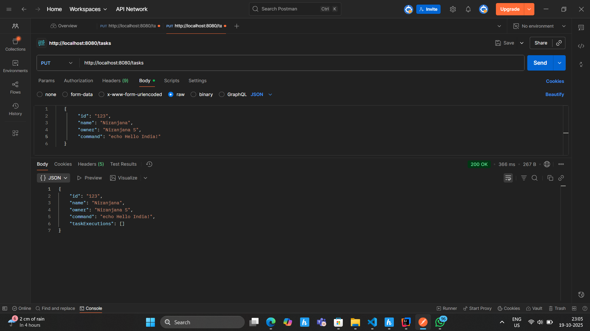
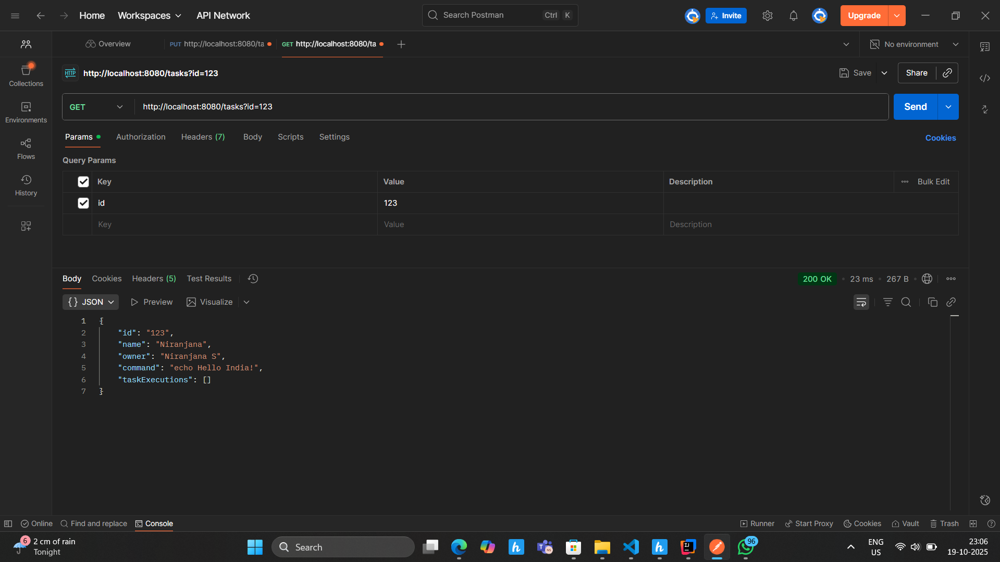
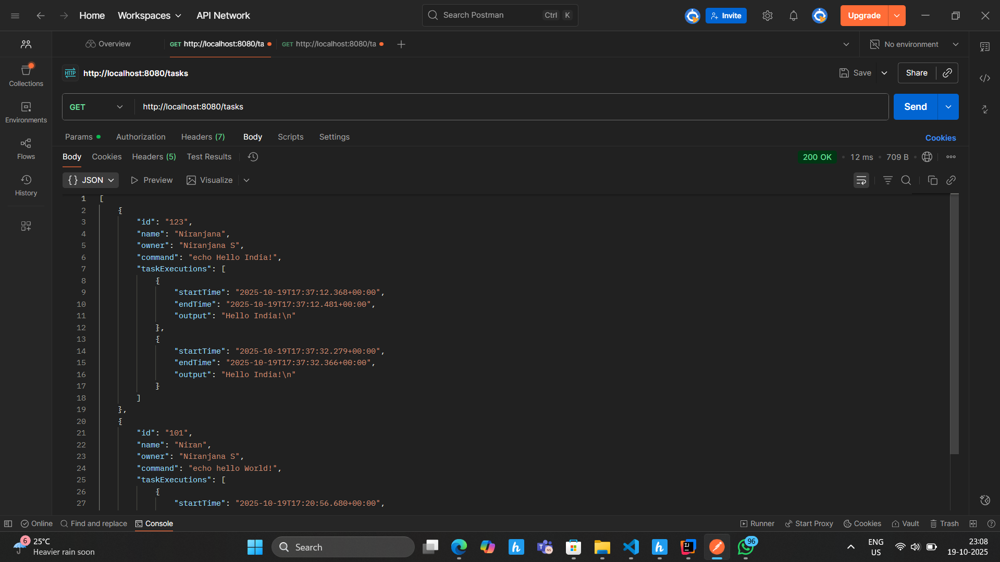
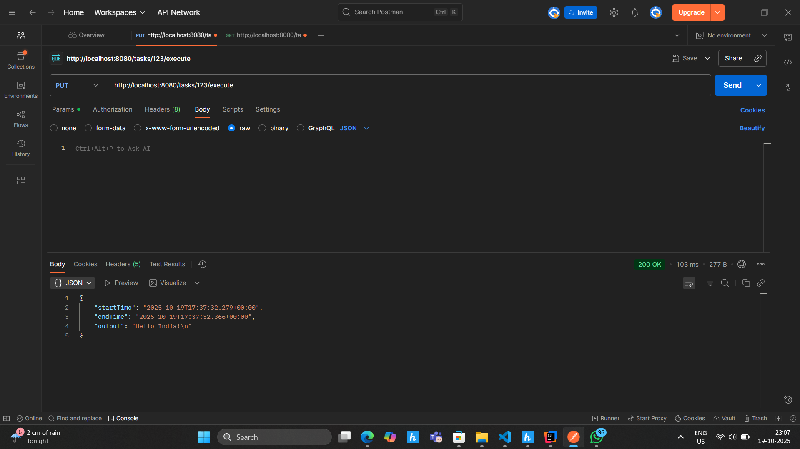

# Task Management REST API - Java Spring Boot

## Project Description
This project is a **Java Spring Boot backend application** that provides a REST API for managing and executing tasks. Each task represents a shell command that can be executed and tracked with execution details. Task data is persisted in a **MongoDB** database.

The system allows you to:
- Create, update, and delete tasks
- Retrieve all tasks or a specific task by ID
- Search tasks by name
- Execute a task command and store its output with timestamps

---

## Approach and Implementation
1. **Spring Boot** is used for building the REST API.
2. **MongoDB** is used as the database to store `Task` and `TaskExecution` objects.
3. The project follows a layered architecture:
   - **Model:** Defines `Task` and `TaskExecution` entities
   - **Repository:** Interface for MongoDB operations
   - **Service:** Business logic including command execution and validation
   - **Controller:** REST endpoints for API requests
4. **Validation:** Commands are checked to avoid unsafe operations (e.g., `rm`, `shutdown`, `sudo`).
5. **Execution:** Commands are executed using Java’s `ProcessBuilder`, and outputs are stored in the corresponding task.

---

## Tools and Technologies Used
- **Java 17**
- **Spring Boot 3.3.4**
- **MongoDB 7.0**
- **Maven** for dependency management
- **Lombok** for reducing boilerplate code
- **IntelliJ IDEA** for development
- **Postman** for API testing

---

## Setup Instructions
Follow these steps to run the project locally:

1. **Clone the repository:**
```bash
git clone https://github.com/Niranjanasnair/task1-java-rest-api.git
```

2. **Open the project in IntelliJ IDEA.**

3. **Ensure MongoDB is running** on your system (default port 27017).

4. **Build the project** using Maven:
```bash
mvn clean install
```

5. **Run the application:**
- Run the main class `SpringProjectApplication.java` in IntelliJ IDEA, or
```bash
mvn spring-boot:run
```

6. **Test the API endpoints** using Postman, curl, or any HTTP client:
- Base URL: `http://localhost:8080/tasks`

---

## REST API Endpoints

| Method | Endpoint | Description |
|--------|----------|-------------|
| GET | `/tasks` | Retrieve all tasks |
| GET | `/tasks?id={taskId}` | Retrieve a task by ID |
| PUT | `/tasks` | Create or update a task (JSON body required) |
| DELETE | `/tasks/{id}` | Delete a task by ID |
| GET | `/tasks/search?name={taskName}` | Search tasks by name |
| PUT | `/tasks/{id}/execute` | Execute a task and save the output |

---

## Sample JSON for Creating a Task
```json
{
  "id": "123",
  "name": "Print Hello",
  "owner": "John Smith",
  "command": "echo Hello World!"
}
```

---

## Screenshots / Results

> All screenshots include Niranjana S and system date/time as proof.

### 1. PUT Task – Create / Update


### 2. GET Task by ID


### 3. GET All Tasks with Executions


### 4. Task Execution – Command Output


### 5. IntelliJ Project Interface


